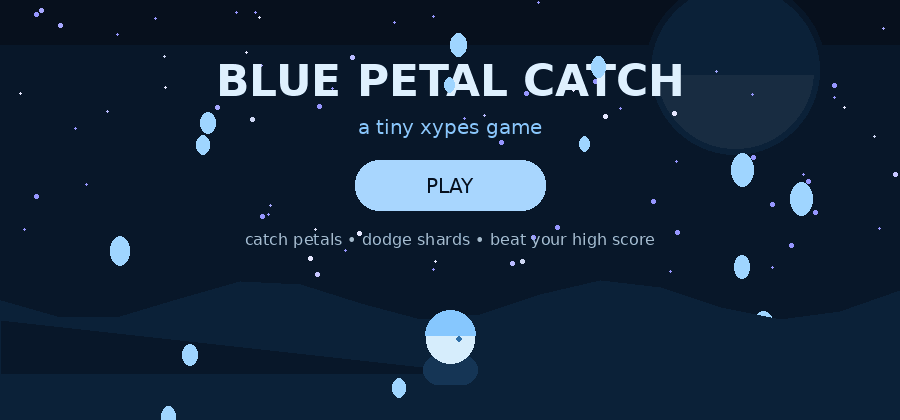

 

 

&nbsp;&nbsp;&nbsp;&nbsp;&nbsp;

&nbsp;&nbsp;&nbsp;&nbsp;&nbsp;

  

tiktok &nbsp;&nbsp;·&nbsp;&nbsp; roblox &nbsp;&nbsp;·&nbsp;&nbsp; discord

   

&nbsp;

&nbsp;

  

  

<b>open my blue room</b>

  

  

 

<a href="https://www.tiktok.com/@pstvroffical">tiktok</a>
&nbsp;&nbsp;·&nbsp;&nbsp;
<a href="https://www.roblox.com/users/3595727417/profile">roblox</a>
&nbsp;&nbsp;·&nbsp;&nbsp;
<a href="https://discord.com/users/1150057914967531651">discord</a>

  

thanks for visiting my little corner.

  

 

<b>a tiny secret</b>

  

  

blue hair supremacy.
 
you weren't supposed to find this...

  

  

 

<b>play something</b>

  

  

  

catch the petals · dodge the dark shards · beat your best score

  

 

 

